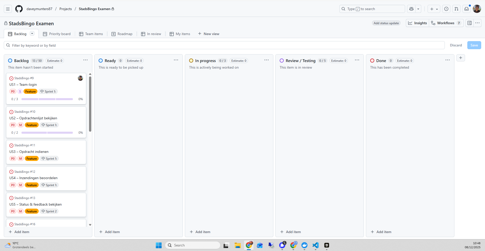
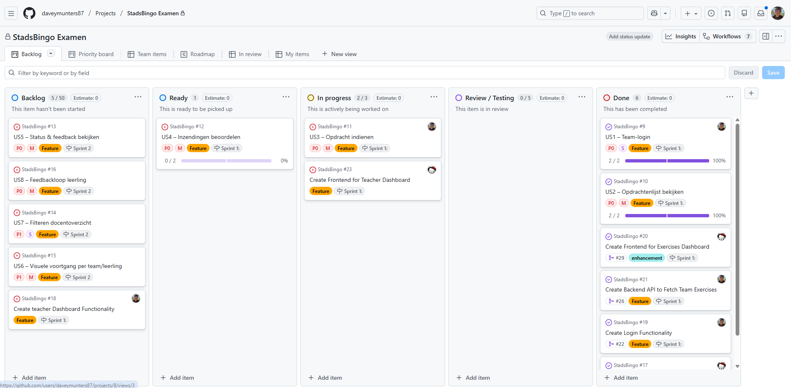

# StadsBingo – 01_plant_werkzaamheden.md

## Projectomschrijving
Het doel van dit project is het ontwikkelen van een **StadsBingo webapplicatie met teams en opdrachten-flow**.  
Leerlingen voeren opdrachten uit in teams in de stad en docenten beheren teams, opdrachten en de voortgang per team en per leerling.  
Het project volgt de **scrum-aanpak** met sprints van 1 week.

**Functionele workflow (samenvatting):**
- Docent maakt teams aan, genereert teamcodes en koppelt leerlingen aan een team (maximaal 5 spelers per team).
- Leerlingen loggen in met een teamcode en zien de opdrachten die voor hun team beschikbaar zijn.
- Elke opdracht heeft een status: `Locked`, `Available`, `Pending`, `Feedback`, `Approved`.
- Leerlingen leveren per opdracht een tekst of foto in; docenten keuren goed of geven feedback.
- Op basis van de beoordeling verandert de status en wordt de volgende opdracht vrijgegeven.
- Zowel docent als leerling zien een visuele voortgang over opdrachten en teams.

---

## Eisen en Wensen van de Opdrachtgever

### Eisen (Must have)
| Nr | Omschrijving | Toelichting |
|----|---------------|-------------|
| E1 | Teams beheren en teamcodes genereren | Docent kan teams aanmaken, bekijken en per team een code genereren |
| E2 | Leerlingen inloggen met teamcode | Leerlingen krijgen toegang tot opdrachten via een teamcode; API verifieert code |
| E3 | Opdrachtenlijst per team bekijken | Leerlingen zien opdrachten die voor hun team beschikbaar zijn |
| E4 | Opdrachten indienen | Leerlingen leveren per opdracht een tekst of foto in |
| E5 | Opdrachtstatus en feedback bekijken | Leerlingen zien status (`Locked`, `Available`, `Pending`, `Feedback`, `Approved`) en feedback |
| E6 | Inzendingen beoordelen | Docenten keuren opdrachten goed of geven feedback |
| E7 | Overzichten en filters voor docent | Docent kan op team, leerling en status filteren in het overzicht |

### Wensen (Should/Could have)
| Nr | Omschrijving |
|----|---------------|
| W1 | Visuele voortgang per team en leerling |
| W2 | Notificatie voor leerlingen bij nieuwe feedback |
| W3 | Gebruiksvriendelijke interface (bijv. mobile friendly) |

---

## Definition of Done (DoD)
Een user story is **done** wanneer:
- Functionaliteit werkt zoals beschreven (E1–E5)  
- Antwoorden zijn opgeslagen en gekoppeld  
- Status en feedback worden correct weergegeven  
- Basis tests zijn aanwezig en slagen  
- Code is leesbaar en in git gecommit  

---

## User Stories

### **Leerling (Student)**

#### 1. Inloggen met teamcode
| **Als een...** | Leerling |
|----------------|----------|
| **Wil ik...**  | kunnen inloggen met een teamcode |
| **Zodat ik...** | toegang krijg tot de opdrachten van mijn team |
| **Prioriteit** | Must have |
| **Acceptatiecriteria** | 1️⃣ Teamcode veld aanwezig op login scherm 2️⃣ Geldige code geeft toegang tot dashboard 3️⃣ Ongeldige code geeft duidelijke foutmelding 4️⃣ Alleen één actieve sessie per team toegestaan 5️⃣ Maximaal 5 spelers per team kunnen inloggen |
| **Scenario** | 1. Leerling opent app → 2. Voert teamcode in → 3. Ziet opdrachtenoverzicht |
| **DoD** | API controleert code, foutmeldingen correct, actieve sessies beperkt |
| **Verantwoordelijke** | Davey |
| **Tijdsindicatie** | M (4 uur) |

#### 2. Opdrachtenlijst en statussen bekijken
| **Als een...** | Leerling |
|----------------|----------|
| **Wil ik...**  | een lijst van opdrachten met hun status zien |
| **Zodat ik...** | weet welke opdrachten locked, beschikbaar, in behandeling of afgerond zijn |
| **Prioriteit** | Must have |
| **Acceptatiecriteria** | 1️⃣ Lijst toont titel/beschrijving + status 2️⃣ `Locked` opdrachten zijn niet klikbaar 3️⃣ `Available`, `Pending`, `Feedback`, `Approved` duidelijk onderscheidbaar |
| **Scenario** | 1. Leerling logt in → 2. Ziet opdrachtenlijst → 3. Opent beschikbare opdracht |
| **DoD** | Lijst rendert stabiel, correcte statussen weergegeven |
| **Verantwoordelijke** | Davey |
| **Tijdsindicatie** | M (4 uur) |

#### 3. Opdracht indienen & feedback verwerken
| **Als een...** | Leerling |
|----------------|----------|
| **Wil ik...**  | een opdracht kunnen inleveren als tekst of foto en feedback kunnen verwerken |
| **Zodat ik...** | bij goedkeuring door kan naar de volgende opdracht |
| **Prioriteit** | Must have |
| **Acceptatiecriteria** | 1️⃣ Validatie: minimaal één van `tekst` of `foto` aanwezig 2️⃣ Na indienen wordt status `Pending` 3️⃣ Bij `Feedback` ziet leerling feedback en kan opnieuw indienen 4️⃣ Bij `Approved` wordt volgende opdracht `Available` |
| **Scenario** | 1. Open opdracht → 2. Vul tekst/foto → 3. Verstuur → 4. Status `Pending` → 5. Docent keurt af → 6. Leerling dient opnieuw in |
| **DoD** | Status-flow (`Available` → `Pending` → `Feedback`/`Approved`) werkt correct |
| **Verantwoordelijke** | Davey |
| **Tijdsindicatie** | M (2–4 uur) |

---

### **Docent (Teacher)**

#### 1. Inzendingen beoordelen
| **Als een...** | Docent |
|----------------|--------|
| **Wil ik...**  | inzendingen kunnen goed- of afkeuren met feedback |
| **Zodat ik...** | voortgang van leerlingen kan bewaken |
| **Prioriteit** | Must have |
| **Acceptatiecriteria** | 1️⃣ Overzicht van inzendingen 2️⃣ Acties: approve/reject 3️⃣ Feedback verplicht bij reject |
| **Scenario** | 1. Open docentdashboard → 2. Selecteer inzending → 3. Kies status + feedback |
| **DoD** | Status/feedback zichtbaar voor leerling |
| **Verantwoordelijke** | Jada |
| **Tijdsindicatie** | M (4 uur) |

#### 2. Filteren in docentoverzicht
| **Als een...** | Docent |
|----------------|--------|
| **Wil ik...**  | kunnen filteren op status en leerling |
| **Zodat ik...** | sneller kan beoordelen |
| **Prioriteit** | Should have |
| **Acceptatiecriteria** | 1️⃣ Filter op status 2️⃣ Zoeken op leerlingnaam |
| **DoD** | Filters wijzigen lijst correct |
| **Verantwoordelijke** | Jada |
| **Tijdsindicatie** | S (2 uur) |

#### 3. Visuele voortgang per team/leerling
| **Als een...** | Docent |
|----------------|--------|
| **Wil ik...**  | visuele voortgang van teams en leerlingen kunnen zien |
| **Zodat ik...** | snel overzicht heb wie opdrachten voltooid heeft of vastloopt |
| **Prioriteit** | Should have |
| **Acceptatiecriteria** | 1️⃣ Voor ieder team een voortgangsbalk 2️⃣ Voor iedere leerling een individuele voortgangsbalk 3️⃣ Kleurcodering status (`Pending`, `Feedback`, `Approved`) |
| **DoD** | Vooruitgang correct weergegeven voor alle teams/leerlingen |
| **Verantwoordelijke** | Jada |
| **Tijdsindicatie** | M (4 uur) |

---

## Sprint Planning

### 🔹 Sprint 1 (Week 1–2)
**Doel:** Basisflow leerling en docent, inclusief login, opdrachtenoverzicht en beoordelen.

| To Do | In Progress | Done |
|-------|------------|------|
| Team login API & dashboard backend (Davey, 4u) | Opdrachtenlijst bekijken (Davey, 4u) | |
| Inzendingen beoordelen (Jada, 4u) | | |

**Sprint 1 DoD:**  
- Leerling kan inloggen met teamcode  
- Leerling ziet opdrachtenlijst  
- Docent kan inzendingen beoordelen  

---

### 🔹 Sprint 2 (Week 3–4)
**Doel:** Frontend dashboard, filters, voortgangsbalken, feedback verwerking.

| To Do | In Progress | Done |
|-------|------------|------|
| Dashboard frontend (Davey, 4–6u) | Visuele voortgang per team/leerling (Jada, 4u) | |
| Opdracht indienen & feedback verwerken (Davey, 2–4u) | Status & feedback bekijken (Davey, 2u) | |
| Filteren docentoverzicht (Jada, 2u) | | |

**Sprint 2 DoD:**  
- Dashboard functioneel voor leerlingen en docenten  
- Feedback en status correct weergegeven  
- Filters werken correct  
- Voortgangsbalken zichtbaar en stabiel  

---

## Planning-overzicht

**Capaciteit:**  
- Team van 2 studenten, ±10 uur/week per persoon  
- Sprintduur: 1 week → totale capaciteit per sprint ≈ 40 uur

| Sprint | Stories (uren) | Totaal uren | Past binnen 40u? |
|--------|----------------|-------------|-----------------|
| Sprint 1 | Team login (4u), Opdrachtenlijst (4u), Inzendingen beoordelen (4u) | 12u | ✅ |
| Sprint 2 | Dashboard frontend (4–6u), Feedback verwerking (2–4u), Filters docent (2u), Voortgangsbalken (4u) | 12–16u | ✅ |

---

## Voortgangsbewaking

**Doel:** aantonen dat voortgang actief wordt bewaakt en keuzes gebaseerd op prioriteit.

| Periode         | Type                  | Bestand | Toelichting |
|----------------|----------------------|---------|------------|
| 08-12 t/m 15-12 | Sprint 1 start       |  | Begin Sprint 1, taken in **To Do** |
| 08-12 t/m 15-12 | Sprint 1 retrospectief | [Sprint 1 Retro](bewijsmateriaal/01/sprint1/sprint1_retro.md) | Reflectie Sprint 1, planning Sprint 2 |
| 08-12 t/m 15-12 | Sprint 1 end         |  | Einde Sprint 1, status van taken |
| 08-12 t/m 15-12 | Sprint 1 commits     | [Commits Sprint 1](bewijsmateriaal/01/sprint1/commit_list_sprint1.md) | Overzicht commits tijdens Sprint 1 |
| 15-12 t/m 22-12 | Sprint 2 start       |  | Begin Sprint 2, taken in **To Do** |
| 15-12 t/m 22-12 | Sprint 2 retrospectief | [Sprint 2 Retro](bewijsmateriaal/01/sprint2/sprint2_retro.md) | Reflectie Sprint 2, planning Sprint 3 |
| 15-12 t/m 22-12 | Sprint 2 end         |  | Einde Sprint 2, status van taken |
| 15-12 t/m 22-12 | Sprint 2 commits     | [Commits Sprint 2](bewijsmateriaal/01/sprint2/commit_list_sprint2.md) | Overzicht commits tijdens Sprint 2 |

---
