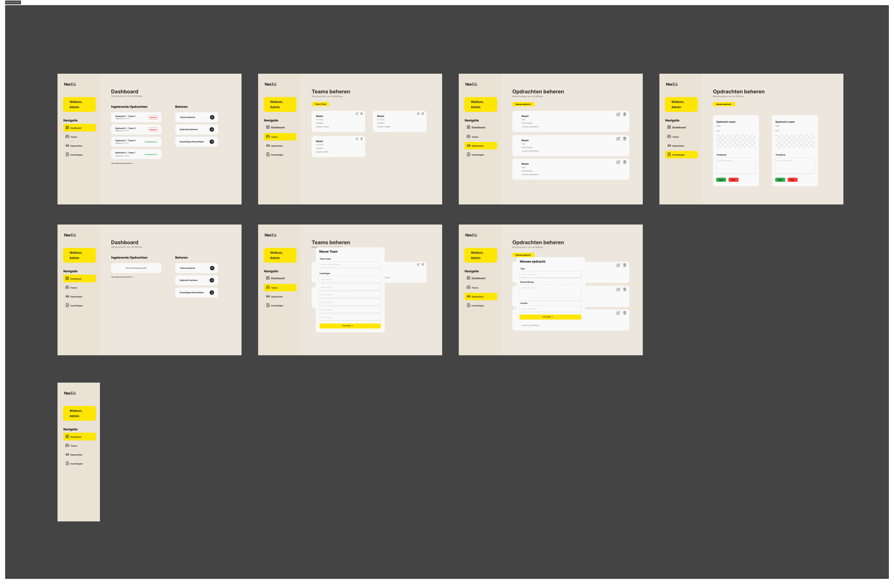

# StadsBingo – 02_ontwerp_software.md

## Omschrijving

Dit document bevat het technisch ontwerp van de StadsBingo.
Het ontwerp is gebaseerd op de eisen, wensen en user stories zoals vastgelegd in *01_plan_werkzaamheden.md*.

## Overzicht gekozen diagrammen

Voor dit project zijn de volgende onderdelen uitgewerkt:
1. **Entity Relationship Diagram (ERD)**
2. **Sequence Diagram**
3. **Figma Ontwerp** (deepdive, wireframes & definitief design)

Deze combinatie is gekozen omdat:

* het ERD inzicht geeft in data, relaties en opslag
* het sequence diagram inzicht geeft in gedrag en interactie tussen systeemonderdelen
* de Figma ontwerpen aantonen hoe nagedacht is over de UI/UX naast de technische architectuur

## 1. ERD (Jada)

### Doel van het ERD

Het ERD beschrijft hoe data binnen de StadsBingo wordt opgeslagen en hoe objecten met elkaar verbonden zijn.

### Entiteiten

Het ERD bevat 6 entiteiten waaronder:

* **User** – gebruiker die teams aanmaakt (docent)
* **Team** – een groep leerlingen
* **TeamPlayer** – individuele speler binnen een team
* **Assignment** – opdracht die uitgevoerd kan worden
* **TeamAssignment** – koppelt opdrachten aan teams (n-op-n)
* **Submission** – inzending van een team voor een opdracht, gekoppeld aan een teamspeler

### Relaties

* **User → Team (1-op-n, creates)**
  Een gebruiker kan meerdere teams aanmaken.
  Dit ondersteunt eis E1 (Teams beheren).

* **Team → TeamPlayer (1-op-n, has)**
  Een team bestaat uit meerdere spelers.
  Dit ondersteunt teamstructuur en leerlingindeling.

* **Team → TeamPlayer (1-op-1, captain)**
  Elk team heeft een captain, die ook een teamspeler is.
  Dit is de 1-op-1 relatie.

* **Team ↔ Assignment (n-op-n, via TeamAssignment)**
  Teams kunnen meerdere opdrachten krijgen en opdrachten kunnen aan meerdere teams worden gekoppeld.
  Deze relatie wordt opgelost met TeamAssignment.

* **Submission (Team + Assignment + TeamPlayer)**
  Een submission legt vast welk team, welke opdracht en welke teamspeler een inzending heeft gedaan en maakt meerdere inzendingen per opdracht mogelijk.

### Koppeling ERD aan user stories en eisen

**Ondersteunde user stories:**

* Leerling: *Inloggen met teamcode*
* Leerling: *Opdrachtenlijst en statussen bekijken*
* Leerling: *Opdracht indienen & feedback verwerken*
* Docent: *Inzendingen beoordelen*
* Docent: *Filteren en voortgang bekijken*

**Ondersteunde eisen en wensen:**

* E1 Teams beheren
* E2 Inloggen met teamcode
* E3 Opdrachten per team
* E4 Opdrachten indienen
* E5 Status & feedback
* E6 Inzendingen beoordelen
* E7 Overzichten en filters
* W1 Visuele voortgang

## 2. Sequence Diagram (Davey)

### Doel van een sequence diagram

Het sequence diagram beschrijft de loginflow van een leerling via een teamcode.
Deze flow is gekozen omdat dit een kernfunctionaliteit is waarbij meerdere onderdelen van het systeem samenwerken.

### Scenario

Het diagram laat de volgende stappen zien:

1. De leerling voert een teamcode in op de loginpagina
2. De frontend stuurt een loginverzoek naar de API
3. De API controleert de teamcode in de database
4. Er vindt een keuze plaats (alternative):

   * het team bestaat
   * het team bestaat niet

### Alternative (alt)

* **Team bestaat**
  De sessie wordt aangemaakt en de leerling wordt doorgestuurd naar het dashboard.

* **Team bestaat niet**
  De API stuurt een foutmelding terug en de leerling blijft op de loginpagina.

### Koppeling sequence diagram aan user stories en eisen

**Ondersteunde user story:**

* Leerling: *Inloggen met teamcode*

**Ondersteunde eisen:**

* E2 Inloggen met teamcode

Het sequence diagram maakt inzichtelijk hoe deze user story technisch wordt uitgevoerd en waar validatie en foutafhandeling plaatsvinden.

## 3. Figma

### Deepdive & Concept

De deepdive is origineel als opdracht aangeleverd en is als basis gebruikt voor de verdere uitwerking van het ontwerp.
Het beschrijft de paginastructuur, typografie en styleguide van de StadsBingo.

* **Pagina overzicht** – Landingspage, Homepage, Navbar, Map, Contact
* **Samenvatting Admin** – overzicht van de docentfunctionaliteit
* **Samenvatting Opdrachten** – overzicht van de opdrachtenstroom
* **Typografie** – Fonts, heading hierarchie en kleuren
* **Logo's** – NexEd logo in twee varianten

### Wireframes & eerste ontwerp — Admin panel

De wireframes tonen de indelingen zonder visuele stijl.
Hieronder is de eerste uitgewerkte versie van het adminpanel te zien.

* **Login / Landingspagina**
* **Dashboard docent**
* **Opdrachten toevoegen & beheren**
* **Inzending beoordelen** 
* **Team wijzigen & aanmaken**

### Definitief ontwerp — Admin panel

De werking van het adminpanel is hetzelfde gebleven als het eerste ontwerp.
Het verschil zit in de UX/UI: de schermen zijn overzichtelijker en consistenter vormgegeven.

### Wireframes & definitief ontwerp — Mobiel (Leerling)

De mobiele wireframes tonen de basisflow voor de leerling.
De uitgewerkte designs laten de volledige gebruikersflow zien van inloggen tot opdrachten indienen.

* **Inloggen met teamcode**
* **Opdrachtenlijst** – met statussen per opdracht
* **Opdrachtdetail** – beschrijving en foto-upload
* **Feedback bekijken** – reactie van de docent
* **Contact & Map pagina**

### Koppeling Figma aan user stories en eisen

**Ondersteunde user stories:**

* Leerling: *Inloggen met teamcode*
* Leerling: *Opdrachtenlijst en statussen bekijken*
* Leerling: *Opdracht indienen & feedback verwerken*
* Docent: *Inzendingen beoordelen*

**Ondersteunde eisen:**

* E1 Teams beheren
* E2 Inloggen met teamcode
* E3 Opdrachten per team
* E4 Opdrachten indienen
* E5 Status & feedback
* E6 Inzendingen beoordelen

## Onderbouwing ontwerpkeuzes

### Privacy

* Alleen gegevens die nodig zijn voor teams, opdrachten en inzendingen zijn opgenomen in het ERD.
* Leerlingen loggen in met een teamcode, waardoor persoonlijke accounts en extra persoonsgegevens niet nodig zijn.
* Unieke ID’s worden gebruikt, zodat gegevens niet eenvoudig te raden of te manipuleren zijn.

### Security

* Teamcodes worden altijd server-side gevalideerd en nooit vertrouwd op frontend-logica.
* Sessies worden beheerd via een server-side cookie in plaats van via URL-parameters.
* Foutmeldingen geven geen extra informatie vrij over bestaande teams of systeemstructuur.

### Dataconsistentie

* Relaties in het ERD voorkomen ongeldige situaties, zoals meerdere captains binnen één team.
* Elke inzending is altijd gekoppeld aan zowel een team als een opdracht.
* Database-relaties en keys zorgen ervoor dat data logisch en betrouwbaar blijft.

## Conclusie

Met het ERD, het sequence diagram en de Figma ontwerpen is een volledig technisch en visueel ontwerp gemaakt dat aansluit op de eisen, wensen en user stories van StadsBingo.
De diagrammen geven inzicht in de datastructuur en de interactie tussen objecten, terwijl de Figma ontwerpen aantonen hoe de gebruikerservaring is uitgedacht van wireframe tot definitief design.