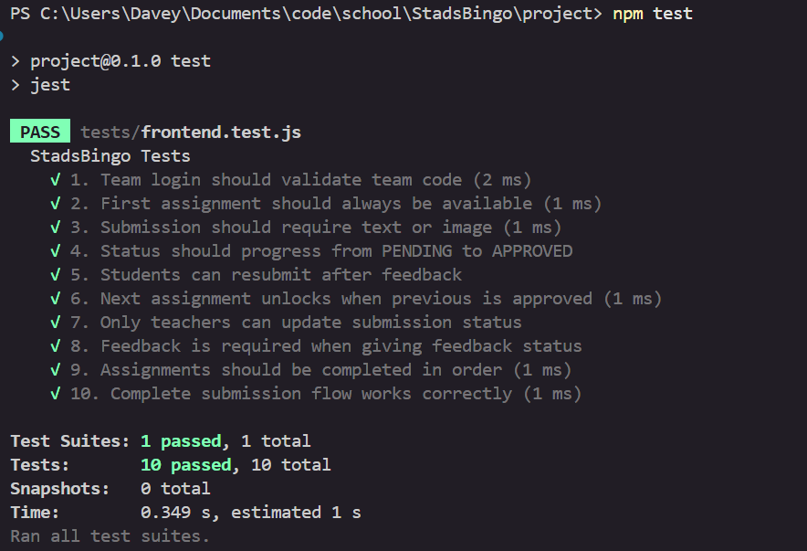

# StadsBingo – 04_test_software.md

## Omschrijving

Dit document beschrijft het **testplan**, de **testscenario's** en het **testrapport** voor de stadsbingom applicatie

---

## Testaanpak - Geautomatiseerd Testen

- Framework: [Jest](https://jestjs.io/) – unit tests
- Testbestand: `tests/frontend.test.js`
- **Totaal aantal tests: 10 geautomatiseerde tests**
- **Uitvoeren tests:** `npm test`

---

## Testplan (Criterium 4.1)

| Test # | Functionaliteit | Testdoel |
|--------|-----------------|----------|
| 1 | Team Login | Validatie van teamcodes |
| 2 | Assignment Status | Eerste opdracht altijd beschikbaar |
| 3 | Submission Validatie | Foto verplicht |
| 4 | Status Progressie | PENDING → APPROVED/FEEDBACK |
| 5 | Feedback Loop | Herindienen na feedback mogelijk |
| 6 | Assignment Unlock | Volgende opdracht vrijgeven |
| 7 | Teacher Permissions | Alleen docenten kunnen beoordelen |
| 8 | Feedback Requirement | Feedback tekst verplicht |
| 9 | Assignment Order | Opdrachten in volgorde |
| 10 | Complete Flow | Hele proces van begin tot eind |

---

## Testscenario's

### Test 1: Team Login Validatie
**Hoofdscenario:** Geldige teamcode geeft toegang
**Alternatieve scenario's:** 
- Lege code → foutmelding
- Ongeldige code → foutmelding

### Test 2: Assignment Status Logic
**Hoofdscenario:** Eerste opdracht altijd beschikbaar
**Alternatieve scenario's:**
- Volgende opdrachten vergrendeld tot vorige goedgekeurd

### Test 3: Submission Validatie
**Hoofdscenario:** Foto verplicht voor inzending
**Alternatieve scenario's:**
- Geen Foto → validatiefout

### Test 4: Status Progressie
**Hoofdscenario:** Status verandert van PENDING naar APPROVED/FEEDBACK
**Alternatieve scenario's:**
- Verschillende acties geven verschillende statussen

### Test 5: Feedback Loop
**Hoofdscenario:** Herindienen mogelijk na feedback
**Alternatieve scenario's:**
- Geen herindienen bij andere statussen

### Test 6: Assignment Unlock
**Hoofdscenario:** Volgende opdracht wordt beschikbaar na goedkeuring
**Alternatieve scenario's:**
- Blijft vergrendeld bij andere statussen

### Test 7: Teacher Permissions
**Hoofdscenario:** Alleen docenten kunnen status wijzigen
**Alternatieve scenario's:**
- Studenten kunnen niet beoordelen

### Test 8: Feedback Requirement
**Hoofdscenario:** Feedback tekst verplicht bij feedback status
**Alternatieve scenario's:**
- Geen feedback tekst bij andere statussen

### Test 9: Assignment Order
**Hoofdscenario:** Opdrachten moeten in volgorde worden gedaan
**Alternatieve scenario's:**
- Latere opdrachten niet toegankelijk

### Test 10: Complete Flow
**Hoofdscenario:** Hele proces werkt van begin tot eind
**Alternatieve scenario's:**
- Alle stappen in de juiste volgorde

---

## Testrapport

### Test Uitvoering
```bash
npm test
```

### Testresultaten

| Test # | Beschrijving | Resultaat | Status |
|--------|--------------|-----------|--------|
| 1 | Team login validatie | Geldige/ongeldige codes correct gevalideerd | Geslaagd |
| 2 | Assignment status logic | Eerste opdracht beschikbaar, rest vergrendeld | Geslaagd |
| 3 | Submission validatie | Foto verplicht werkt correct | Geslaagd |
| 4 | Status progressie | PENDING → APPROVED/FEEDBACK correct | Geslaagd |
| 5 | Feedback loop | Herindienen na feedback mogelijk | Geslaagd |
| 6 | Assignment unlock | Volgende opdracht vrijgeven werkt | Geslaagd |
| 7 | Teacher permissions | Alleen docenten kunnen beoordelen | Geslaagd |
| 8 | Feedback requirement | Feedback tekst verplicht bij feedback | Geslaagd |
| 9 | Assignment order | Opdrachten in juiste volgorde | Geslaagd |
| 10 | Complete flow | Hele proces werkt correct | Geslaagd |

**Totaal: 10/10 tests geslaagd**

### Conclusie

**Alle 10 geautomatiseerde tests zijn geslaagd**. De belangrijkste functionaliteiten van de StadsBingo applicatie werken:

1. **Team authenticatie** - Veilige toegang via teamcodes
2. **Opdracht progressie** - Logische volgorde en status
3. **Inzending validatie** - Correcte validatie van foto
4. **Status management** - Juiste statusovergangen
5. **Feedback systeem** - Werkende feedback loop
6. **Docent functionaliteit** - Juiste permissies en validaties

**Screenshot bewijs:**  

*Jest test output met alle 10 tests geslaagd*