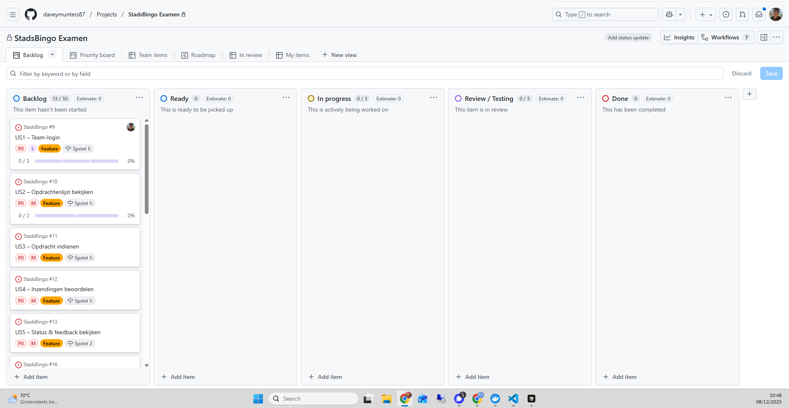

# Sprint 1 – Commit overzicht

**Periode:** 08-12-2025 t/m 08-01-2026  
**Project:** StadsBingo  

---

## 1. Commits overzicht
Hieronder een overzicht van belangrijke commits in Sprint 1. Screenshots kunnen toegevoegd worden bij elke commit. Auteurs toegevoegd en gekoppeld aan user stories.

| Datum | Commit ID / Screenshot | Beschrijving | User Story | Auteur |
|-------|----------------------|------------|-----------|-------|
| 08-12-2025 | n.v.t. (documentatie) | Documentatie-update planning/bewijs (geen codecommit) | Planning (1.3/1.4) | Davey & Jada |

---

## 2. Toelichting voortgang
- Prioriteiten werden dagelijks afgewogen: Team-login en opdrachtenlijst eerst, submission feedbackloop later.  
- Planning aangepast toen submission feature complexer bleek dan verwacht.  
- Screenshots van Kanban board en commit screenshots tonen dat taken verplaatst zijn tussen `In Progress` → `Review/Testing` → `Done`.  
- Voor elke commit is aangegeven wie verantwoordelijk was, zodat examinatoren duidelijk zien wie welke feature heeft gerealiseerd.

---

# 3. Dagelijkse voortgang & Kanban screenshots (Sprint 1)

**Eis:** Binnen deze sprint wordt elke dag een screenshot gemaakt van het Scrum board.  
Hierbij staat telkens een toelichting over hoe de planning (uit opdracht 1.3) zich verhoudt tot de actuele voortgang en of er aanpassingen zijn gedaan.

> *Screenshots worden opgeslagen in:*  
> `/examen/bewijsmateriaal/01/sprint1/dagX-board.png`

---

## 📅 Dag 1 – 08-12-2025

**Planning:** Taken verdelen en project structuur opzetten. (Davey/Jada)
**Voortgang:** Repo opgezet, project structuur aangemaakt en taken verdeeld.
**Aanpassing planning:** Geen aanpassing, op schema

---

