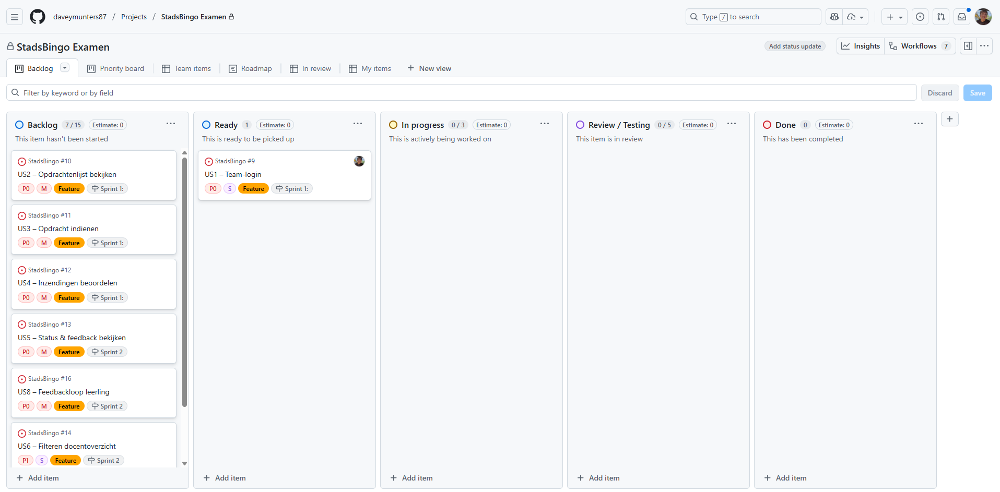
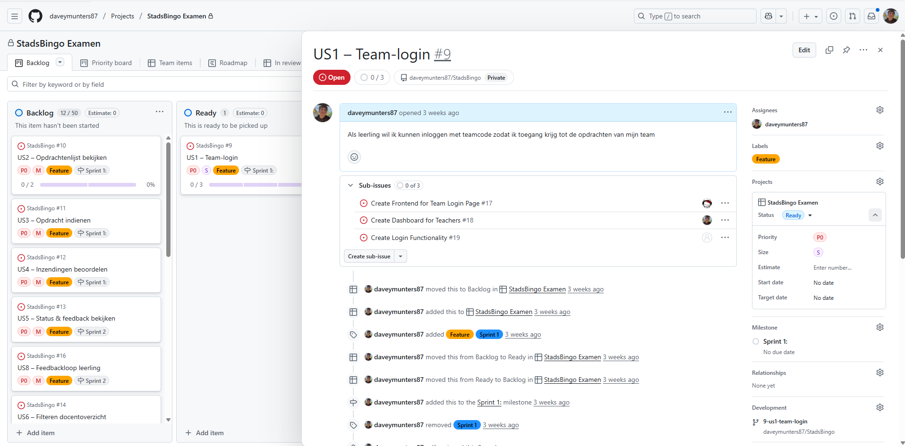
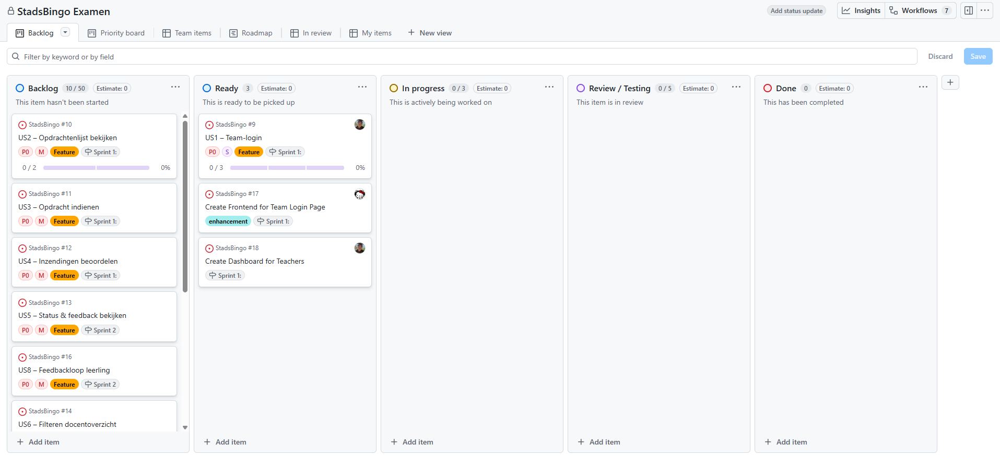
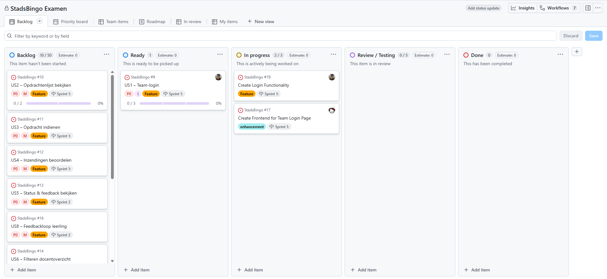

# Dagplanning – StadsBingo

criteria 1.1–1.4

---

# Logs

## Dag 1 (08-12-2025) 
### Davey & Jada
**Screenshot:**  

**Gepland:** Planning sprint 1, bewijsmaterialen, repo structure
**Gerealiseerd:** 
- Planning sprint 1
- Bewijsmaterialen structuur
- Repo structure opzetten 

**Afwegingen/keuzes:** Geen aanpassingen nodig, alles volgens planning.

---

## Dag 2 (09-12-2025)
**Screenshot:**  

### Jada  
**Gepland:** Create Frontend for Team Login Page (US1)   
**Gerealiseerd:** Ik heb een basis opgezet zodat we makkelijk kunnen beginnen met het testen van de auth  
**Afwegingen/keuzes:** Ik heb er voor gekozen om het design in Figma voor nu achterwegen te laten en dit pas toe te voegen als ik weet dat alles in mijn frontend (login page) werkt.

### Davey  
**Gepland:** Create login functionality (US1)      
**Gerealiseerd:** 
- Start bouwen API routes

**Afwegingen/keuzes:** Geen aanpassingen nodig, alles volgens planning.

---

## Dag 3 (10-12-2025)
**Screenshot:**  

### Jada  
**Gepland:** Create Frontend for Team Login Page (US1)   
**Gerealiseerd:** Verder gegaan met het bouwen van de opzet, zodat de auth getest kan worden met dummy data.  

**Afwegingen/keuzes:** Geen aanpassingen nodig, alles volgens planning.

### Davey  
**Gepland:** Create login functionality (US1)    
**Gerealiseerd:** 
- Verder uitwerken/testen van de API routes.

**Afwegingen/keuzes:** Geen aanpassingen nodig, alles volgens planning.

---

## Dag 4 (11-12-2025)
**Screenshot:**  

### Jada  
**Gepland:** Create Frontend for Team Login Page (US1)  
**Gerealiseerd:**
- Helpen met de API-functionaliteit implementeren in de opzet die gebouwd is.

**Afwegingen/keuzes:** Geen aanpassingen nodig, alles volgens planning.

### Davey  
**Gepland:** Create login functionality (US1)  
**Gerealiseerd:** 
- API-functionaliteit implementeren in de frontend

**Afwegingen/keuzes:** Geen aanpassingen nodig, alles volgens planning.

---

