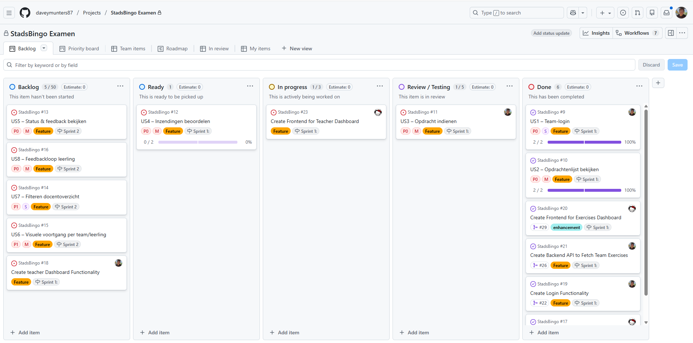
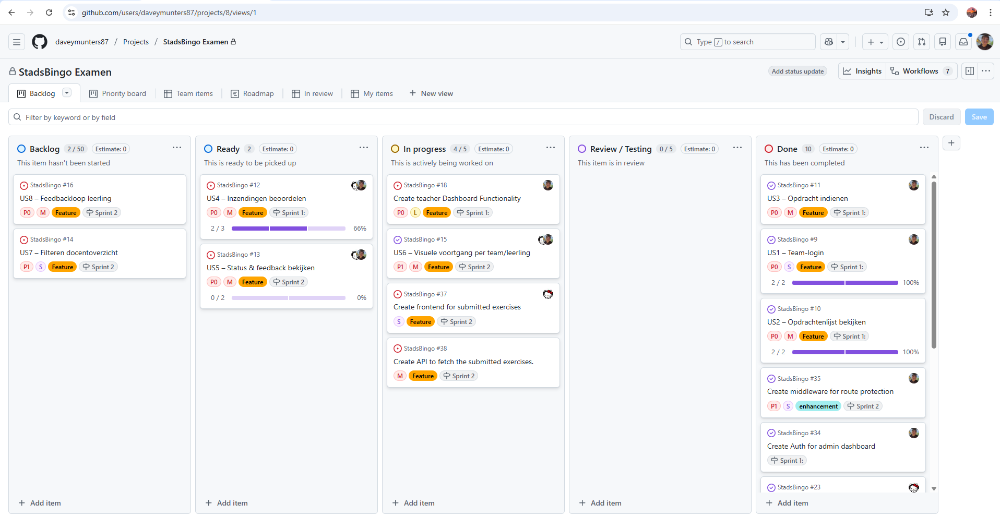
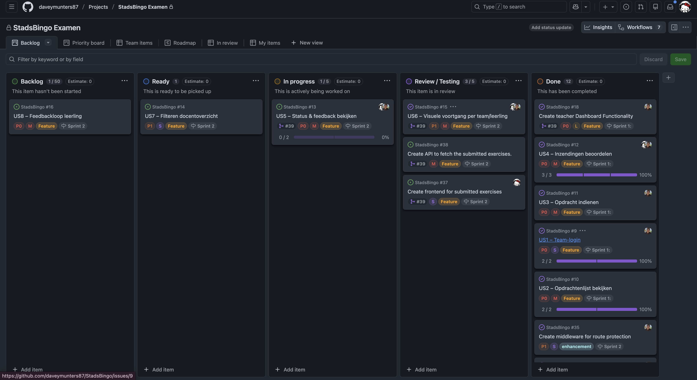
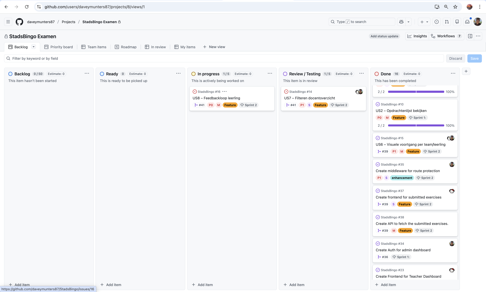
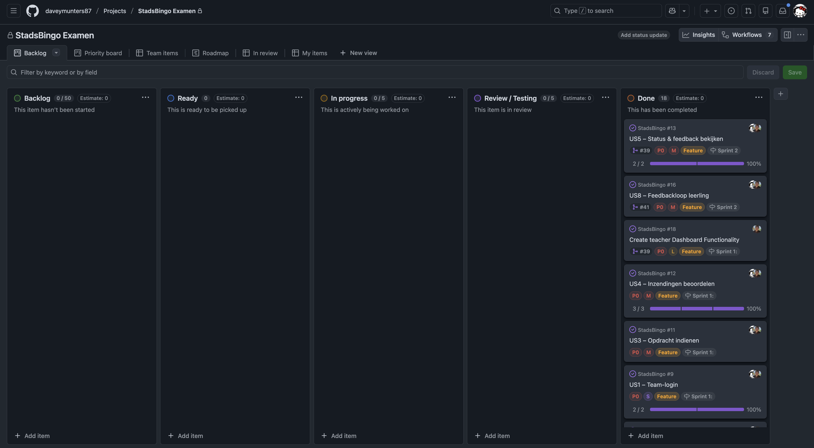

# Dagplanning – StadsBingo

---

# Logs

---

## Dag 1 (15-12-2025) 
**Screenshot:**  

### Jada  
**Gepland:** US4 – Inzendingen beoordelen
**Gerealiseerd:**
- Frontend gemaakt voor het Admin dashboard (Crud system for teams en opdrachten)
- API integratie voor aangemaakte Teams en opdrachten

**Afwegingen/keuzes:** Deel van de frontend niet afgemaakt, kwam niet uit met de planning er en ging wat meer tijd in.

### Davey
**Gepland:** US3 – Opdracht indienen 
**Gerealiseerd:** 
- API route gemaakte waarin de user de gemaakte exercise kan submitten, deze komt dan in de DB.

**Afwegingen/keuzes:** Geen aanpassingen nodig, alles volgens planning.

---

## Dag 2 (16-12-2025)
**Screenshot:**  

### Jada  
**Gepland:** Edit Frontend for admin panel (US15 / US6)   
**Gerealiseerd:** Ik heb de nav bar van de admin panel aangepast, het is nu een stuk duidelijker dan dat we hadden. Ik heb dit eerst in Figma gemaakt en vervolgens overgenomen.
 Ook heb ik mijn opzet van gisteren aangepast zodat het overzichtiger word.
- 

**Afwegingen/keuzes:** Ik heb deze keuzes gemaakt omdat dit onze userflow en UI verbeterd en het er simpel weg beter uit ziet.

### Davey  
**Gepland:**  Make Admin dashboard functional (US15 / US6)  
**Gerealiseerd:** 
- API Routes gemaakt voor onderdelen admin dashboard
- Middleware gebouwd om toegang te blokkeren voor secure routes.

**Afwegingen/keuzes:** Nog niet alles in de admin dashboard volledig functioneel, planning doorgeschoven naar morgen.

---

## Dag 3 (17-12-2025)
**Screenshot:**  

### Jada  
**Gepland:** US5/US6 Optimaliseren en refactoren van de frontend
**Gerealiseerd:** Ik heb elke pagina in de admin dashboard gerefactored door middel van gebruik te maken van components om het overzichterlijker te maken. Ook ben ik wat dieper op de UX/UI gegaan voor de teams/opdrachten paginas met het tonen van de form. Ik heb dit eerst in Figma gedesigned en vervolgens in het project uitgebouwd

**Afwegingen/keuzes:** Ik heb de keuze gemaakt om van het design af te wijken om de UX en userflow te verbeteren.

### Davey 
**Gepland:** Make Admin dashboard functional (US15 / US6)  Part 2
**Gerealiseerd:** 
- Alle componenten voorzien van de betreffende api integraties
- Middleware voor de admin beter gemaakt. De /admin was nog niet goed beveiligd.

**Afwegingen/keuzes:** Geen aanpassingen nodig, alles volgens planning.

---

## Dag 4 (18-12-2025)
**Screenshot:**  

### Jada  
**Gepland:** US7 - Filteren docentoverzicht / US8 – Feedbackloop leerling (Frontend)
**Gerealiseerd:**
- UX van de teams verbetered door sweat alerts toe te voegen en status van opdracht beter te laten zien.
- Image modal gemaakt waardoor de docent de ingeleverde foto makkelijker en duidelijker kan bekijken.

**Afwegingen/keuzes:** Geen aanpassingen nodig, alles volgens planning.

### Davey  
**Gepland:** US7 - Filteren docentoverzicht / US8 – Feedbackloop leerling (Backend)
**Gerealiseerd:** 
- Filter voor admin gemaakt. Deze kan filteren op Alle, Voltooide, Wachtende en Feedback opdrachten. Ook kan er per team gefiltert worden.
- Feedback systeem gemaakt waardoor docenten opdrachten kunnen goedkeuren of afkeuren met bijbehorden feedback. Deze word dan in het team dashboard van de gebruiker weergeven.

**Afwegingen/keuzes:** Geen aanpassingen nodig, alles volgens planning.

---

## Dag 5 (19-12-2025)
**Screenshot:**  

### Jada  
**Gepland:**  Testing en verbeteren UX
**Gerealiseerd:**
- De laatste kleine dingen zoals locatie user aanpassen en hamburger voor user optimaliseren

**Afwegingen/keuzes:** Geen aanpassingen nodig, alles volgens planning.

### Davey  
**Gepland:** Testing en verbeteren UX
**Gerealiseerd:** 
- De laaste finishing touches gedaan aan de UI van de team dashboard.
- Testen van alle functionaliteiten, zodat deze goed werken.

**Afwegingen/keuzes:** Geen aanpassingen nodig, alles volgens planning.

---

